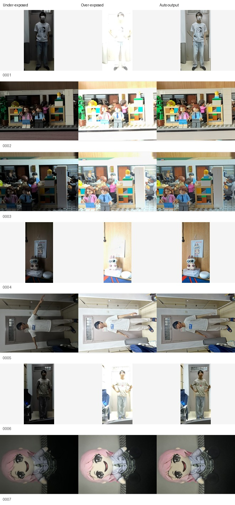

# UltraFusion-Extreme

This repository is a reproduction and inference-time extension of the official UltraFusion project:

- Official code: [OpenImagingLab/UltraFusion](https://github.com/OpenImagingLab/UltraFusion)
- Paper: [UltraFusion: Ultra High Dynamic Imaging using Exposure Fusion](https://arxiv.org/abs/2501.11515), CVPR 2025 Highlight
- Official project page: [openimaginglab.github.io/UltraFusion](https://openimaginglab.github.io/UltraFusion/)

This is not an official UltraFusion release. The original model architecture, training code, and pretrained weights belong to the UltraFusion authors. This repository focuses on a small reproduction-oriented extension: real-shot extreme exposure cases, inference-time alignment analysis, and practical scripts for inspecting failure modes.

## What This Project Adds

Compared with the upstream UltraFusion repository, the current work adds:

- `data/UltraFusion-Extreme-Cases`: 7 real-shot under/over-exposed image pairs captured as stress cases.
- `--strategy {align,noalign,auto}` in `inference.py`: explicit control over pre-alignment behavior.
- `--steps`, `--limit`, and `--max_long_edge`: practical inference controls for limited GPU memory.
- `scripts/diagnose_alignment.py`: RAFT pre-alignment diagnosis without running the full diffusion model.
- `scripts/multi_exposure_fuse.py`: brightness ordering and pair planning for multi-exposure experiments.
- `scripts/build_report.py`: static HTML gallery generation from saved outputs.
- `scripts/make_contact_sheet.py`: compact contact-sheet generation for README/project-page previews.
- `docs/benchmark.md`: benchmark notes and preview baseline settings.
- `docs/method.md`: notes on the observed alignment and multi-exposure failure modes.

The goal is not to claim a new SOTA model. The goal is to make the reproduction more useful as an open-source project by documenting where UltraFusion works, where it struggles, and how to inspect those cases.

## Preview Baseline

The image below shows a lightweight preview baseline on all 7 `UltraFusion-Extreme-Cases` scenes.



This preview was generated on an 8GB RTX 4060 Laptop GPU with a reduced setting:

```shell
python inference.py --dataset UltraFusionExtreme --output results_baseline_preview --tiled --tile_size 512 --tile_stride 256 --strategy auto --steps 10 --max_long_edge 512 --save_all
python scripts/build_report.py --input results_baseline_preview/UltraFusionExtreme --output reports/baseline_preview.html --title "UltraFusion-Extreme Preview Baseline"
python scripts/make_contact_sheet.py --input results_baseline_preview/UltraFusionExtreme --output assets/extreme_baseline/preview_contact_sheet.jpg --prefix UltraFusionExtreme --count 7
```

This is intentionally a preview baseline, not a full-quality benchmark. It uses only 10 diffusion steps and resizes each input to a 512 px long edge, so some visual results are weaker than default full-resolution UltraFusion inference. See [docs/benchmark.md](docs/benchmark.md) for the exact settings and caveats.

## Repository Layout

```text
.
├── data/
│   └── UltraFusion-Extreme-Cases/    # 7 real-shot stress cases
├── docs/
│   ├── benchmark.md                  # benchmark notes and preview baseline
│   └── method.md                     # reproduction observations
├── scripts/
│   ├── diagnose_alignment.py         # RAFT/mask diagnosis
│   ├── multi_exposure_fuse.py        # multi-exposure pair planner
│   ├── build_report.py               # HTML gallery builder
│   └── make_contact_sheet.py         # README contact sheet builder
├── ultrafusion_extreme/
│   ├── alignment.py
│   └── exposure.py
├── inference.py
├── train.py
└── val_nriqa.py
```

Most model code is inherited from the upstream UltraFusion repository.

## Installation

Use the same environment style as the official project:

```shell
conda create -n UltraFusion python=3.10
conda activate UltraFusion
pip install -r requirements.txt
```

Prepare pretrained weights in `ckpts/`:

- `raft-sintel.pth`
- `v2-1_512-ema-pruned.ckpt`
- `fcb.pt`
- `ultrafusion.pt`

Please download these from the official UltraFusion instructions or the linked upstream resources. Large checkpoints are not included in this repository.

## Run Inference

Run the original benchmark-style inference:

```shell
python inference.py --dataset UltraFusion --output results --tiled --tile_size 512 --tile_stride 256 --prealign --save_all
```

Run the real-shot extreme cases:

```shell
python inference.py --dataset UltraFusionExtreme --output results --tiled --tile_size 512 --tile_stride 256 --strategy auto --save_all
```

For limited GPU memory, use the preview setting:

```shell
python inference.py --dataset UltraFusionExtreme --output results_baseline_preview --tiled --tile_size 512 --tile_stride 256 --strategy auto --steps 10 --max_long_edge 512 --save_all
```

The `--strategy` option controls the pre-alignment branch:

- `align`: use RAFT pre-alignment.
- `noalign`: skip pre-alignment and use the under-exposed image directly as guidance.
- `auto`: choose based on occlusion-mask and saturation statistics.

## Diagnose Alignment

To inspect RAFT alignment and occlusion masks without running the full diffusion model:

```shell
python scripts/diagnose_alignment.py --dataset UltraFusionExtreme --output reports/alignment_diagnosis --max_long_edge 512
```

This writes per-scene images and a `summary.json` file:

- under-exposed input
- over-exposed input
- IMF-adjusted under-exposed image
- warped under-exposed image
- occlusion mask
- flow magnitude visualization
- recommended alignment strategy

Build an HTML gallery from the diagnosis outputs:

```shell
python scripts/build_report.py --input reports/alignment_diagnosis --output reports/alignment_diagnosis.html
```

## Multi-Exposure Planning

UltraFusion is a two-image method, but real HDR capture often provides more than two exposures. This repository includes a small planner for sequential pair experiments:

```shell
python scripts/multi_exposure_fuse.py --input_dir path/to/exposure_burst --order bright-to-dark --output reports/multi_exposure_plan --write_pair_datasets
```

Supported order policies:

- `bright-to-dark`
- `dark-to-bright`
- `anchor-extremes`

The script ranks images by brightness, builds pair plans, and can materialize pair datasets that are consumable by `inference.py`.

## Current Findings

The current reproduction work focuses on two practical observations:

1. RAFT pre-alignment and forward-backward consistency masks can fail in saturation-heavy scenes, especially when the over-exposed image loses most texture or the motion region is small.
2. Sequential multi-exposure fusion is order-sensitive. Dark-to-bright fusion may repeatedly regenerate highlight regions and blur details; bright-to-dark fusion can preserve structure better but may produce lower overall brightness.

These findings are documented in [docs/method.md](docs/method.md). They should be treated as reproduction observations and engineering hypotheses, not as a complete new algorithm.

## Data Notes

`UltraFusion-Extreme-Cases` follows this structure:

```text
data/UltraFusion-Extreme-Cases/
├── 0001/
│   ├── ue.png
│   └── oe.png
├── ...
└── metadata.json
```

`ue.*` is the under-exposed input. `oe.*` is the over-exposed input.

The dataset is small and intended for stress testing, debugging, and project demonstration. It is not a replacement for the official UltraFusion benchmark.

## Roadmap

- Add full-resolution baseline results on a larger GPU.
- Tune `auto` alignment thresholds against the real-shot cases.
- Add a soft-mask alignment mode.
- Add side-by-side `align` / `noalign` / `auto` reports.
- Add no-reference IQA metrics and ghosting proxy metrics.
- Expand the real-shot extreme benchmark with more scenes and metadata.

## Acknowledgements

This repository is built on top of the official UltraFusion codebase:

```text
UltraFusion: Ultra High Dynamic Imaging using Exposure Fusion
Zixuan Chen, Yujin Wang, Xin Cai, Zhiyuan You, Zheming Lu, Fan Zhang, Shi Guo, Tianfan Xue
CVPR 2025 Highlight
```

The original UltraFusion project is developed on the codebase of [DiffBIR](https://github.com/XPixelGroup/DiffBIR).

## Citation

If you use the original UltraFusion model, paper, or codebase, please cite the official paper:

```BibTeX
@InProceedings{Chen_2025_CVPR,
    author    = {Chen, Zixuan and Wang, Yujin and Cai, Xin and You, Zhiyuan and Lu, Zheming and Zhang, Fan and Guo, Shi and Xue, Tianfan},
    title     = {UltraFusion: Ultra High Dynamic Imaging using Exposure Fusion},
    booktitle = {Proceedings of the Computer Vision and Pattern Recognition Conference (CVPR)},
    month     = {June},
    year      = {2025},
    pages     = {16111-16121}
}
```

